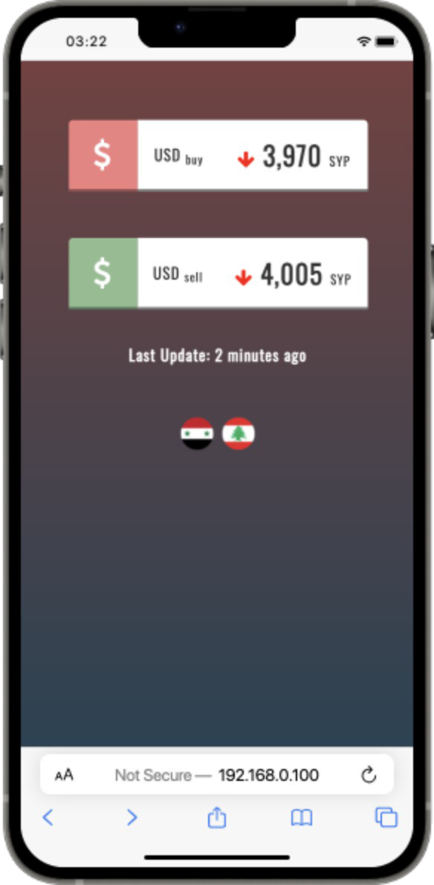

  

  <h3 align="center">Lira Exchange Rates</h3>

  

   A simple web app to get current lira exchange rates in real time for a number of countries...
     
    <a href="#product-screenshot"><strong>Explore it »</strong></a>
     
     
    <a href="https://github.com/karamalhamoud/Lira-Exchange-Rates/issues">Report Bug</a>
    ·
    <a href="https://github.com/karamalhamoud/Lira-Exchange-Rates/issues">Request Feature</a>
  

  [![Forks][forks-shield]][forks-url]
  [![Stargazers][stars-shield]][stars-url]
  [![Issues][issues-shield]][issues-url]
  [![MIT License][license-shield]][license-url]

 

# About The Project

 

  

There are many great apps & websites for exchange rates on the internet, but I haven't found one that relies only on the market price of the local lira, so I created this enhanced one.

  

## ⚒ Built With

The following languages & frameworks were used in this project:
* [TypeScript](https://www.typescriptlang.org/)
* [Php](https://www.php.net/)
* [Less](http://lesscss.org/)

  

## 📝 License

Distributed under the MIT License. See `LICENSE` for more information.

## 🤙 Contact

  
<b align="right"><a href="#top">back to top</a></b>

[forks-shield]: https://img.shields.io/github/forks/karamalhamoud/Lira-Exchange-Rates.svg?style=for-the-badge
[forks-url]: https://github.com/karamalhamoud/Lira-Exchange-Rates/network/members
[stars-shield]: https://img.shields.io/github/stars/karamalhamoud/Lira-Exchange-Rates.svg?style=for-the-badge
[stars-url]: https://github.com/karamalhamoud/Lira-Exchange-Rates/stargazers
[issues-shield]: https://img.shields.io/github/issues/karamalhamoud/Lira-Exchange-Rates.svg?style=for-the-badge
[issues-url]: https://github.com/karamalhamoud/Lira-Exchange-Rates/issues
[license-shield]: https://img.shields.io/github/license/karamalhamoud/Lira-Exchange-Rates.svg?style=for-the-badge
[license-url]: https://github.com/karamalhamoud/Lira-Exchange-Rates/blob/master/LICENSE
